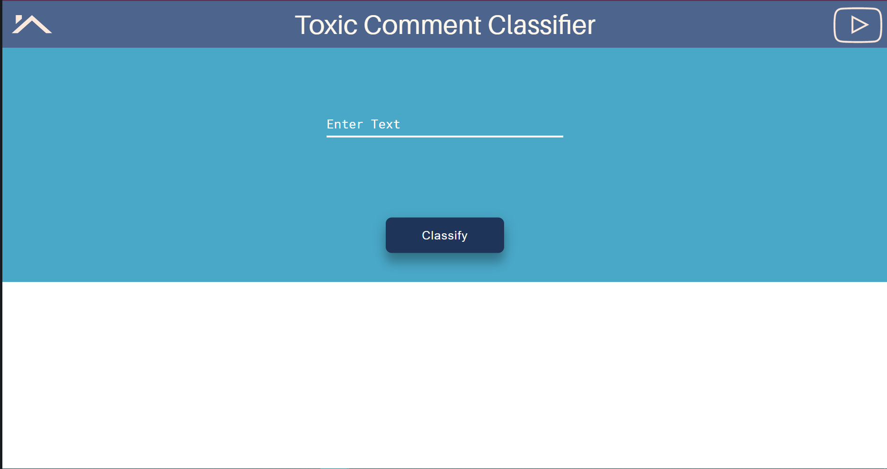
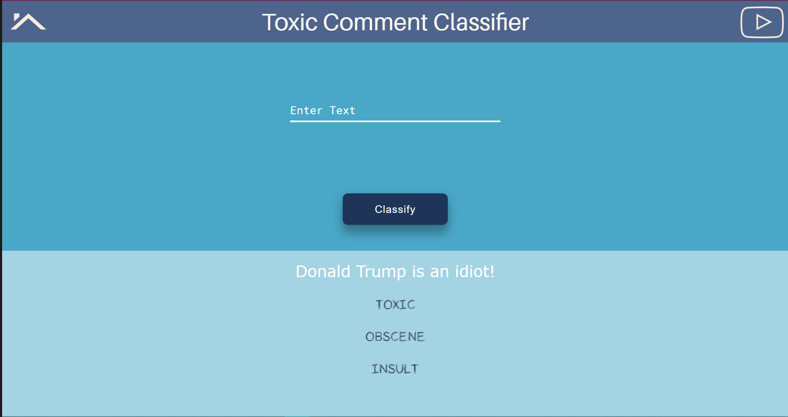

# Toxic Comment Classification

### Table of Contents

- [Project Motivation](#motivation)
- [Project Components](#components)
  - [NLP model](#etl_pipeline)
  - [Webpage Design](#ml_pipeline)
  - [Deployment](#flask)
- [Usage](#usage)
  - [Local](#local)
  - [Web](#web)
- [Screenshots](#screenshots) 
- [Contribute](#contribute)

***

<a id='motivation'></a>

## 1. Project Motivation

With all the good that social media has given us, the rise of toxic comments on the web quite possibly overshadows the positivity in a horrible way. What if these comments can be picked up by a machine learning model, and thus censor it? Let's do it then!

<a id='components'></a>

## 2. Project Components

There are three components in this project:

<a id='etl_pipeline'></a>

### 2.1. NLP model

File `classifier.py` contains data code to classify comments. It uses Keras on top of Tensorflow. To make the loading faster, the `tokenizer` object has been pickled via `pickle`. The data on which it was trained can be found [here](https://www.kaggle.com/c/jigsaw-toxic-comment-classification-challenge/data)

<a id='ml_pipeline'></a>

### 2.2. Webpage Design

Folder  `static` contains the HTML, CSS and JS files, along with the necessary SVG and font files. The `script.js` uses JQuery. The rest of the code is pretty much vanilla. 

### 2.3. Deployment

File `app.py` contains the Flask code to run the app on a web server. It uses AJAX calls from `script.js` to render the webpage. Then, it is deployed on Heroku.

***

<a name="usage"/>

## Usage

<a id='local'></a>

### 3.1 Use app locally

To run the app locally on your machine, follow these steps in your terminal:
* `git clone https://github.com/kaustubh-ai/clasify_toxic_comments.git`
* `cd clasify_toxic_comments`
* Create a python virtual environment. Follow [this](https://packaging.python.org/guides/installing-using-pip-and-virtual-environments/)
* `pip install -r requirements.txt`
* `python app.py`
<br><br>
That's it! Your instance should be running at https://127.0.0.1:5000

### 3.2 Use app at Heroku

Just go to https://txc-cmt.herokuapp.com/. Simple as that!

***

<a name="screenshots"/>

## Screenshots




***

<a name="contribute"/>

## Contribute
1.  Fork the repository from Github
2.  Clone your fork

`git clone https://github.com/kaustubh-ai/clasify_toxic_comments.git`

3.  Add the main repository as a remote

```git remote add upstream https://github.com/kaustubh-ai/clasify_toxic_comments.git```

4.  Create a pull request!
